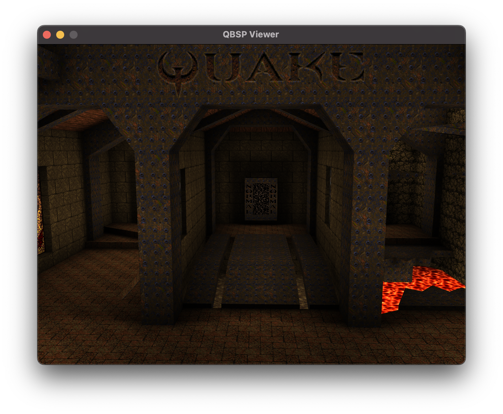

# LIBQBSP

## library to read Quake1 BSP files.

bsp files are used directly by the quake engine to render a level. libqbsp provides an interface to easily load a level and throw it at your renderer of choice.

### current features

* converts coordinates to OpenGL
* lightmap support (only vanilla base style for now)

